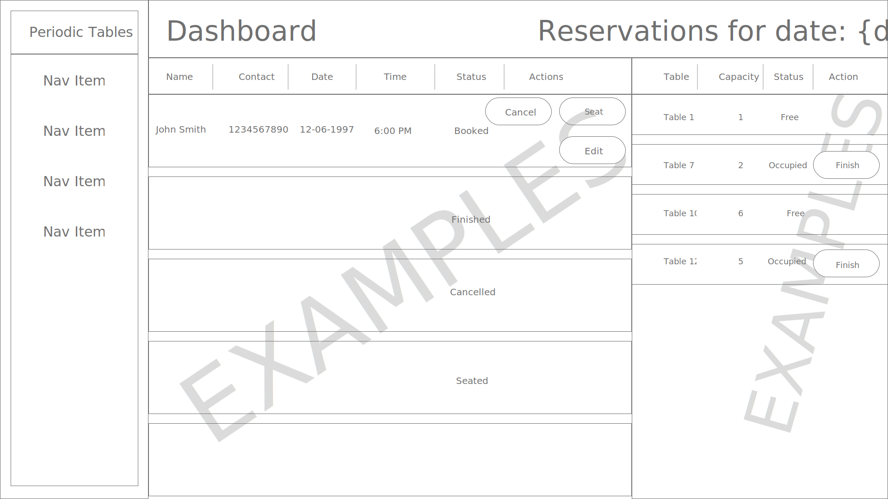
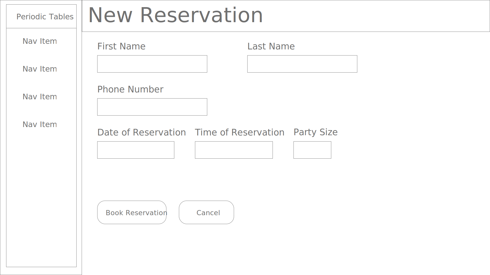
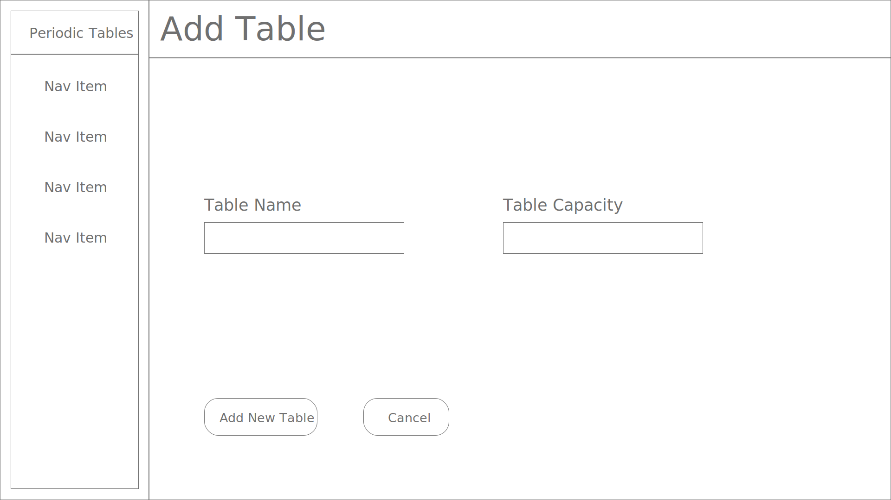

# Restaurant Reservation System

The software is for restaurant personnel to manage reservations and tables at their restaurants.  
This is a monorepo.

### 1. Working Prototype (to do later)

(Example) You can access a working prototype of the React app here: https://your-app-client.herokuapp.com/ and Node app here: https://your-app-server.herokuapp.com/

### 2. User Stories

##### US-01 Create and list reservations (Importance - High)

- As a restaurant manager
- I want to create a new reservation when a customer calls
- so that I know how many customers will arrive at the restaurant on a given day.

##### US-02 Create reservation on a future, working date (Importance - High)

- As a restaurant manager
- I only want to allow reservations to be created on a day when we are open
- so that users do not accidentally create a reservation for days when we are closed.

##### US-03 Create reservation within eligible timeframe (Importance - Medium)

- As a restaurant manager
- I only want to allow reservations to be created during business hours, up to 60 minutes before closing
- so that users do not accidentally create a reservation for a time we cannot accommodate.

##### US-04 Seat reservation (Importance - High)

- As a restaurant manager,
- When a customer with an existing reservation arrives at the restaurant
- I want to seat (assign) their reservation to a specific table
- so that I know which tables are occupied and free.

##### US-05 Finish an occupied table (Importance - High)

- As a restaurant manager
- I want to free up an occupied table when the guests leave
- so that I can seat new guests at that table.

##### US-06 Reservation Status (Importance - Medium)

- As a restaurant manager
- I want a reservation to have a status of either booked, seated, or finished
- so that I can see which reservation parties are seated, and finished reservations are hidden from the dashboard.

##### US-07 Search for a reservation by phone number (Importance - Low)

- As a restaurant manager
- I want to search for a reservation by phone number (partial or complete)
- so that I can quickly access a customer's reservation when they call about their reservation.

##### US-08 Change an existing reservation (Importance - Medium)

- As a restaurant manager
- I want to be able to modify a reservation if a customer calls to change or cancel their reservation
- so that reservations are accurate and current.

### 3. Functionality

The app's functionality includes:

- Creating, editing, and cancelling a reservation
- Creating and managing tables within restaurant
- Managing the status of a seated reservation and their table
- Searching reservations quickly, by phone number
- View reservations and table statuses

### 4. Technology

- Front-End: HTML5, CSS3, JavaScript ES6, React, Bootstrap
- Back-End: Node.js, Express.js, Mocha, Chai, RESTful API Endpoints, Postgres
- Development Environment: Vercel, DBeaver

### 5. Wireframes

|       Dashboard (desktop) path: /dashboard       | New Reservation Form (desktop) path: /reservations/new  |      Add Table Form (desktop) path: /tables/new       |
| :----------------------------------------------: | :-----------------------------------------------------: | :---------------------------------------------------: |
|  |  |  |

### 6. Front-end Structure - React Components Map (to do later)

- (Example) **Index.js** (stateless)
  - **App.js** (stateful)
    - **LandingPage.js** (stateful) - gets the _"prop name"_ and the _"callback prop name"_ from the **App.js**
      - **Login.js** (stateful) -
      - **Register.js** (stateful) -
    - **Navbar.js** (stateless) -

### 7. Back-end Structure - Business Objects (to do later)

- (Example) Users (database table)
  - id (auto-generated)
  - username (email validation)
  - password (at least 8 chars, at least one alpha and a special character validation)

### 8. API Documentation (to do later)

#### API Overview

```text
    /api
    .
    ├── /auth
    │   └── POST
    │       ├── /login
    ├── /users
    │   └── POST
    │       └── /
```

##### POST `/api/auth/login`

```js
    // req.body
    {
        "user_name": "demo@gmail.com",
        "password": "Password1"
    }

    // res.body
    {
    "authToken": String,
        "userId": 1
    }
```

##### POST `/api/users/`

```js
    // req.body
    {
        "user_name": "demo@gmail.com",
        "password": "123456"
    }


    // res.body
    {
        "id": 1,
        "user_name": "demo@gmail.com"
    }
```

### 9. Screenshots (to do later)

(Example) Landing Page
:-------------------------:

Register Page


### 10. Development Roadmap (to do later)

This is v1.0 of the app, but future enhancements are expected to include:

- (Example) add more functionality

### Installation

1. Fork and clone this repository.
1. Run `cp ./back-end/.env.sample ./back-end/.env`.
1. Update the `./back-end/.env` file with the connection URL's to your ElephantSQL database instance.
1. Run `cp ./front-end/.env.sample ./front-end/.env`.
1. You should not need to make changes to the `./front-end/.env` file unless you want to connect to a backend at a location other than `http://localhost:5000`.
1. Run `npm install` to install project dependencies.
1. Run `npm run start:dev` to start your server in development mode.

If you have trouble getting the server to run, reach out for assistance.

##### Local React scripts

- To install the react project ===> npm install
- To run react (on port 3000) ===> npm start
- To run tests ===> npm run test

##### Local Node scripts

- To install the node project ===> npm install
- To migrate the database ===> npm run migrate -- 1
- To run Node server (on port 8000) ===> npm run dev
- To run tests ===> npm run test
